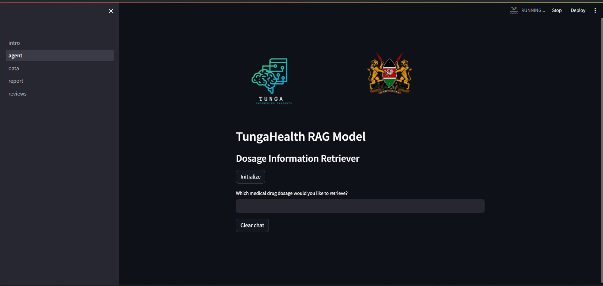
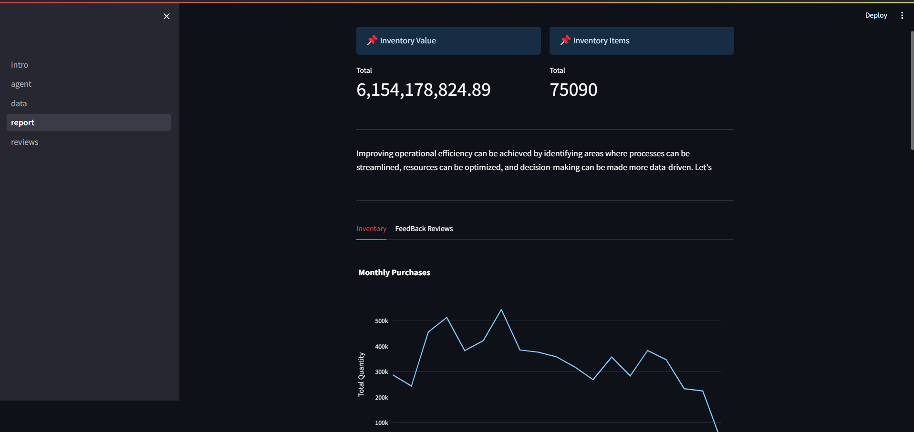
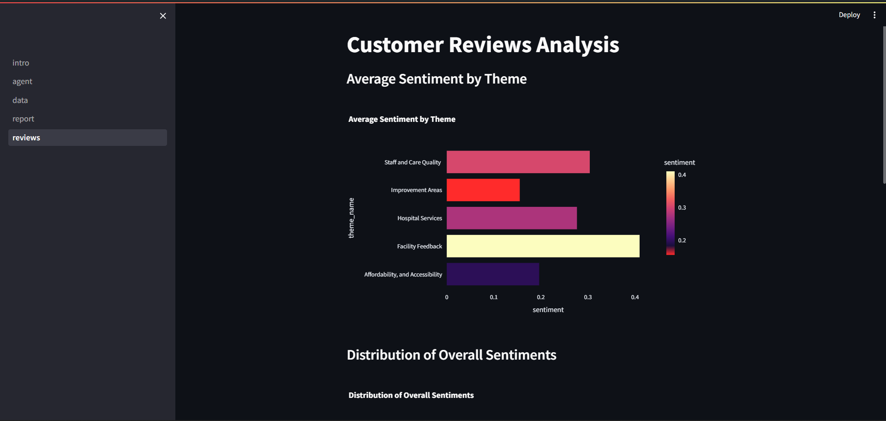

# Healthtic AI

## Overview
This repository contains the source code for the AI-driven chatbot developed during the HAKI Hackathon. The project leverages a Jupyter notebook analysis and a Streamlit application to provide a user-friendly interface where stakeholders can interact directly with data insights and make informed decisions quickly.

## Features
- **Stock Analytics**: Contains comprehensive analysis of stock data including purchases, drug categories, and quantity of drugs purchased.
- **Chatbot**: A Utilizes Meditron model to give prespriction information that enhances decision-making processes.
- **AI-Driven Insights**: Application of AI to analyze hospital reviews end evaluate the quality of services.

### Home Page



### Inventory Manamagement




### Hospital Review Analytics




## Installation

### Prerequisites
- Python 3.8+
- pip

### Setup
1. Clone the repository:
   ```bash
   https://github.com/tungaResearch/tungaHealth.git
   cd tungaHealth
